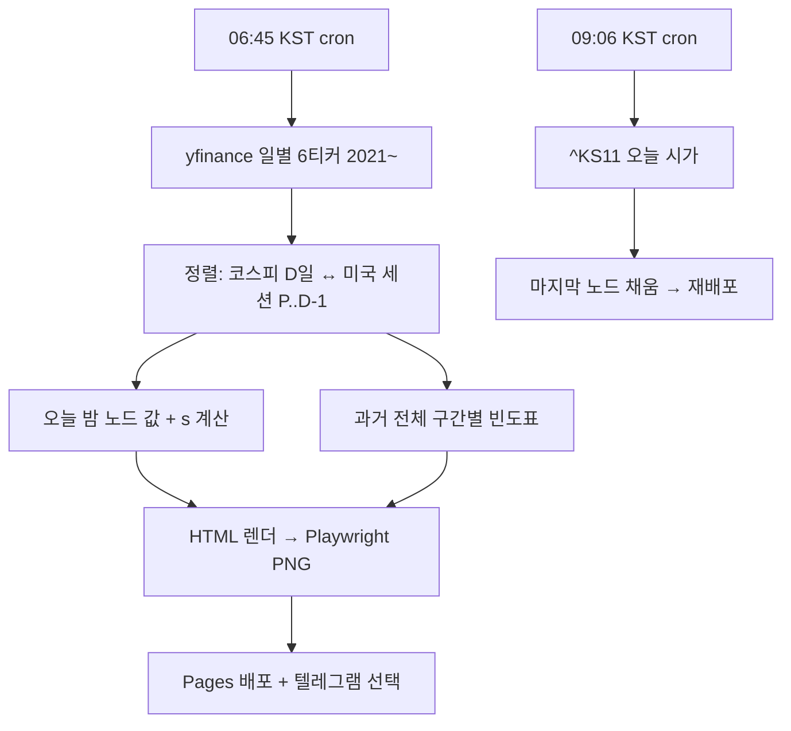

# 밤사이 코스피 (구 코스피 릴레이) — 설계

> 2026-09-06 이름 변경: 검색 자동완성 실측("코스피 " 1위 야간선물, "밤사이 미국증시" 실존)으로 은유(릴레이)보다 시간 프레임(밤사이)이 수요 어휘. 릴레이는 차트 이름으로 존치.

## Overview

**What.** 매일 아침 한 장. 전날 코스피 마감에서 밤사이 미국 마감을 거쳐 오늘 코스피 시가까지, 바통이 어떻게 넘어왔는지 보여주는 정적 페이지 + 공유용 이미지. 하단에 조건부 빈도 한 줄 — "지난 5년, 이런 밤 다음 날 코스피 시가는 N번 중 M번 위로 열렸습니다."

**Why.** 개장 전 정보는 이미 넘치지만(네이버·다음·삼프로·증권사 시황) 전부 숫자 나열이거나 말로 풀어 놓은 것. 밤의 *구조*를 한 장으로 보여주는 형식이 없다. 판정(예측)은 규제·정확도 부담이 있고, 성적표는 서비스 자체를 도박판으로 만든다. 흐름 + 과거 빈도만 보여주고 판단은 보는 사람에게 남긴다.

**근거.** 2021-01~2026-09 백테스트(n=1,314, 표본 외 1,062): 미국 마감(SPY·SOXX)만으로 코스피 시가 방향이 확신 구간 86%, 연도별 전부 ≥80%. 적합 없는 고정식 `(SPY+SOXX)/2 × 0.4`도 84%. 즉 밤과 아침 사이 관계는 실재하고, 결정적 코드로 충분하다. 상세: 메모리 `project_kospi_open_relay`.

**누가.** 아침 7시 전후 폰으로 "오늘 어떻게 열리나" 확인하는 국내 개인 투자자. 텔레그램·X에서 이미지 한 장으로 소비.

## Constraints (어길 수 없는 것)

- **예측 문구 금지.** "갭업 예상", "오를 것" 류 단정 표현 없음. 과거 빈도 서술만. 매수·매도·종목 언급 없음. 하단 고지: 정보 제공, 투자 판단 아님
- **원시 시세 숫자 최소화.** 지수 절대값 대신 변화율(%)만 표시. 인트라데이 데이터 사용 안 함(일별 종가·시가만)
- **시가까지만 말한다.** 갭과 당일 나머지 장의 상관은 0.137. "오늘 장"이 아니라 "오늘 시가"
- **앱인토스 아님.** 시황 = 금융서비스 취급. 웹 전용
- **유지비 0.** 서버 없음. GitHub Actions 크론 + GitHub Pages 정적 배포
- **한국 색 규약.** 상승 = 빨강, 하락 = 파랑

## Principles (지향)

- 형식이 무기. 스크린샷돼 돌아다닐 만큼 한 장이 단정해야 함. 장식보다 위계
- 매일 같은 시각, 같은 형식. 습관이 재방문 장치
- 미국이 조용했는데 한국이 튄 날도 그대로 보인다. 릴레이는 사후에 시가 노드가 채워져 기록이 된다

## Requirements

### Narrative

06:45 KST, 액션이 돈다. 어제 코스피·코스닥 마감을 첫 노드로, 05:00에 끝난 미국 세션(S&P500·나스닥100·필라델피아 반도체를 ETF SPY·QQQ·SOXX로, 공포지수 VIX)을 둘째 노드로 세로 릴레이를 그린다. 그 아래 조건부 빈도 한 줄. 마지막 노드 "오늘 코스피 시가"는 비어 있다. 페이지와 PNG를 Pages에 배포하고, 토큰이 있으면 텔레그램 채널에 PNG를 올린다.

09:06 KST, 두 번째 액션. 오늘 코스피 시가를 받아 마지막 노드를 채우고 재배포한다. 릴레이가 완성된 어제 페이지는 그대로 기록으로 남는다(`/2026-09-05/`). 휴장이면 시가 노드에 "휴장".

### Details

**데이터 (v0).** yfinance 일별: `^KS11 ^KQ11 SPY QQQ SOXX ^VIX`. 2021-01-01부터 전체 재수집(상태 없음). 미국 세션 귀속: 코스피 전일 종가 날짜 P ≤ 미국 세션 날짜 ≤ D-1, 그 구간 close-to-close 누적. 해당 세션 없으면(미국 휴장) "밤사이 미국 휴장" 표시.
→ 결정: v0는 야후(ToS 회색, 비용 0). **애드센스 켜는 시점에 유료 API(월 3만원대)로 전환**이 트리거.

**릴레이 노드.** ① 15:30 코스피·코스닥 마감 % ② 05:00 미국 마감 SOXX·QQQ·SPY % + VIX 변화 ③ 09:00 코스피 시가 %(비움→채움). 유럽·EWY는 정보량 0이라 제외.

**조건부 빈도.** 신호 `s = 0.4 × (SPY + SOXX) / 2`. 5구간: s ≥ +0.5% / +0.3~+0.5 / ±0.3 / −0.3~−0.5 / ≤ −0.5. 오늘 밤이 속한 구간의 과거 전체(2021~)에서 시가 갭 >+0.3% / <−0.3% / 그 사이 비율을 세고, 최다 결과를 문장으로: "지난 N년 이런 밤 M번 중 K번(P%) 시가가 위로 열렸습니다." 보합 구간이면 "±0.3% 안에서 열린 날이 P%". 표본 수 항상 노출.

**출력.** `site/index.html`(오늘), `site/YYYY-MM-DD/index.html`(기록), `site/relay.png`(1080×1350, 공유용), `site/latest.json`. PNG는 같은 HTML을 Playwright로 캡처 — 페이지와 이미지가 한 디자인.

**배포.** GitHub Actions cron `45 21 * * 0-4`(06:45 KST 월~금) · `6 0 * * 1-5`(09:06 KST). Pages 배포. 텔레그램은 `TELEGRAM_BOT_TOKEN`·`TELEGRAM_CHAT_ID` 시크릿 있을 때만.

**실패 처리.** 야후 실패 → 직전 페이지 유지, 액션 실패 알림(GitHub 기본). 부분 실패(티커 하나 결손) → 해당 노드 "—" 표시하고 나머지 발행. 조건부 빈도는 SPY·SOXX 둘 다 있을 때만.

### Flow

## 앱인토스 트랙 (추가, 같은 날 밤)

June 결정으로 미니앱도 낸다. 웹 파이프라인이 단일 진실이고, 미니앱은 `latest.json`(SVG 포함)·`days/*.json`·`index.json`을 읽어 그리는 얇은 껍데기다. 로직 중복 0.
- 화면: 오늘 릴레이 카드 → 조건부 빈도 → 공유(TDS Button, lazy) → 지난 릴레이 날짜 칩 → 설명·고지. 자체 내비바·탭바·진입 모달 없음
- 첫 페인트는 번들 시드(`scripts/gen-seed.mjs`)로 네트워크 무관. TDS는 lazy 청크+ErrorBoundary
- 딥링크 `/d/YYYY-MM-DD` (후행 슬래시 정규화)
- 정책 방어: 종목·매매·예측 없음, 카테고리 생활>정보>기타(환율 신호등 선례)

## Non-goals

예측·판정 문구 / 성적표·적중률 / 인트라데이 곡선 / 종목·섹터 / 로그인·알림 / 유럽·환율·EWY 노드(정보량 0) / 야간선물(합법 무료 소스 없음)

## 미결

도메인(없으면 `mjs0611.github.io/kospi-relay`) · 텔레그램 채널 개설 · 애드센스 시점

## References

메모리 `project_kospi_open_relay` `reference_market_data_licensing` `project_signal_series` `feedback_ideation_filter`

## 다크 홀로그래픽 전환 (2026-09-06)

밝은 신문 톤 → 다크. 로직·데이터·카피는 그대로, 표현 계층만 교체.
웹·텔레그램 PNG·앱인토스 미니앱 **세 채널 모두** 같은 토큰을 쓴다.

**왜 토큰 한 벌로 끝나는가.** 차트 SVG는 `relay.py`가 만들어 JSON에 실어 배포하고
웹·PNG·미니앱이 같은 그림을 렌더한다. 그 SVG 안에는 하드코딩된 색이 **하나도 없고**
`--paper --ink --muted --rule --band --up --down --flat --sans --mono` 10개 변수만 참조한다.
그래서 호스트가 변수를 다크로 정의하면 차트가 통째로 따라온다. 이 성질을 깨지 말 것 —
SVG에 색을 직접 박는 순간 세 채널이 갈라진다.

**색 규율**

| 층 | 색 | 역할 |
|---|---|---|
| 광원 | night `#6C4DE0` · dawn `#1FC8B8` | 재질·시간. 의미 없음 |
| 데이터 | up `#FF6B5E` · down `#6E9BFF` · flat `#98A3BA` | 등락에만 |
| 필드 | void `#080B18` · paper `#0F1526` | 바닥 |
| 잉크 | `#EAEEF7` / `#98A3BC` | 2단 위계 |

Constraints의 **상승 빨강·하락 파랑은 그대로**. 다크에서 원래 값(`#D9433B`·`#2C5FD6`)은
2.4~3.0:1로 미달이라 색상은 두고 명도만 올렸다.
광원(보라·틸)은 데이터 색(빨강·파랑)과 색상이 겹치지 않게 골랐고, 광원은 카드 바탕,
데이터 색은 차트 안으로 **위치까지 분리**한다. 섞이면 등락이 색으로 안 읽힌다.

**서명 — 시간축 광원.** SVG 세로축이 곧 시간이다(위 15:30 전일 마감 → 아래 09:00 오늘 시가).
그래서 차트 뒤 그라디언트를 위는 밤(인디고), 아래는 새벽(틸)으로 깔았다. 축은 SVG 높이의
10~90% 구간(`sy`가 40..H-40으로 매핑)이라 스톱을 거기 맞췄다. 장식이 아니라 제목의 시각화다.

**채널별 주의**
- PNG는 `.sheet`만 잘라낸다 → 광원을 `body`가 아니라 `.sheet` 안에 둬야 텔레그램 카드에도 실린다.
- 미니앱은 카드가 화면을 거의 덮는다 → 페이지 배경 광원은 거의 안 보인다. 그래서 차트 안 그라디언트가 본체다.
- TDS는 다크 모드가 없다(패키지에 `colorMode` 없음). `color="dark"`는 회색 `#4E5968`이고
  라운드 토큰이 주입되지 않아 반경 0으로 떨어진다. `.actions .tds-mobile-button`에
  `overflow:hidden` + 표면 배경을 덮어 감쌌다. 이모션 해시 클래스는 빌드마다 바뀌므로 구조로 잡을 것.

**대비는 계산하지 말고 잰다.** 반투명 유리 뒤로 광원이 비치고 SVG는 그라디언트 위에 얹혀서,
표면 색만으로 한 계산은 실제 렌더보다 과대평가한다. `contrast-check.py`가 스크린샷 픽셀에서
직접 잰다(글자색 근방을 제외하고, 빈출 상위 배경 중 가장 밝은 것 = 최악). 색·투명도·광원을
건드리면 다시 돌릴 것. 현재 두 채널 전 항목 AA 통과.

## 광고 (2026-09-06 결정)

June 결정: **유료 API 전환 없음. 야후 무료 데이터 유지, 라이선스 회색지대는 감수.** 41번 줄의
"애드센스 시점 = 유료 API 전환" 트리거는 이 결정으로 해제.

미니앱에 **하단 배너 하나**(`app/src/components/BannerAd.tsx`, `TossAds.attachBanner`, theme dark).
위치는 설명·고지 아래 맨 끝 — 카드→공유 바이럴 동선을 안 끊고, 고지가 콘텐츠와 광고 사이 완충.
노필·렌더 실패 시 컴포넌트가 스스로 사라지고(`onNoFill`/`onAdFailedToRender`), 광고가 붙기 전엔
`.ad-banner:empty{display:none}`로 빈 칸을 안 남긴다. 구좌 ID는 `app/.env`의 `VITE_BANNER_AD_GROUP_ID`
(콘솔 발급, 비우면 테스트 배너). `app/.gitignore`에 `.env`가 없었어서 추가함.

리워드·전면은 넣지 않는다. 10~20초 세션 앱이라 리워드는 잠글 게 없고 전면은 이탈만 만든다.
SDK 3.3.0 기준 가능한 형식: `TossAds`(배너) · `loadFullScreenAd`(전면) · `GoogleAdMob`(리워드·전면).

잔여 리스크(인지하고 감수): 앱인토스 정책이 "유료 정보 제공 서비스"를 금지하고 금융 도메인엔
조건부 허용 조항이 없음. 광고 소재에 투자·리딩방이 붙으면 "예측 안 함" 포지션과 충돌 —
콘솔에서 금융 소재 차단 가능 여부 확인 필요. 웹 애드센스는 여전히 미결.

## 아하 모먼트 — 결과 헤드라인 + 시가 밴드 (2026-09-07)

**증상.** "지난 밤들에서 과거 날짜로 가도 다 똑같다" + "뭘 봐야 할지 모르겠다".
**원인(실측).** 클라이언트는 정상(Chrome 재현: 날짜·문장·SVG 전부 바뀜, 네트워크 200). 문제는 데이터 설계:
공개된 20일 중 10일이 같은 '보합' 구간이라 빈도 문장·막대가 바이트 단위로 동일. 그리고 카드가
"이런 밤 뒤엔 51%가 보합"까지만 말하고 **오늘 시가가 거기 들었는지는 끝내 말하지 않는다** — 결말 없는 이야기.

**설계.** 카드 맨 위 한 줄 `head`가 하루를 두 박자로 만든다.
- 아침(pending): "이런 밤 541번 중 **51%**는 ±0.3% 안에서 열렸습니다 — 답은 09:00 시가" (다시 열게 하는 훅)
- 시가 후(filled): "오늘 시가 **+2.76%**. 이런 밤 뒤 32%만 그랬던 쪽, 위로 열렸습니다" / 다수면 "51%가 그랬듯"
- 휴장: "오늘 휴장 — 이런 밤 뒤엔 51%가 …"
날짜마다 자기 시가로 문장이 달라지므로 "다 똑같다"가 사라진다. 숫자만 등락색, 나머지는 잉크.
차트는 시가 행에 **±0.3% 밴드**를 깔아 시가 점이 안/밖인지 눈으로 먼저 읽히게 하고,
어제 마감 노드는 톤다운(질문의 주역은 뉴욕 마감→오늘 시가).

**Constraints 준수.** 예측 문구 없음 — 과거 빈도와 오늘 시가의 *분류*만. "맞았다/틀렸다/적중" 어휘 금지.
**Non-goal 유지.** 단일 일자 분류만. 누적 적중률·성적표는 만들지 않는다(그 선을 넘으면 성적표가 된다).

**구현.** `relay.py` `headline()`(stdlib만 — `test_headline.py`가 ast로 뽑아 검증) → JSON `head`
→ `page()`·`Relay.tsx`가 `lead + <b class=z-{zone}>num</b> + tail`로 공통 렌더. 옛 JSON엔 `head`가 없어
미니앱은 미표시(하위 호환). 과거 날짜 반영은 `workflow_dispatch backfill` 1회 필요.

**스케줄(같은 날).** 첫 예정 cron(9/7 06:45)이 통째로 빠져 latest가 9/4에 머묾. 정각·45분 회피 + 재시도:
morning 06:47·07:20, open 09:09·09:40·10:30(최종). 파이프라인은 멱등. 아침 재시도의 텔레그램 중복은
gh-pages `latest.json`(같은 날·pending)로 막고, open 단계에 시가가 없어도 최종 크론 전엔 휴장으로 단정하지 않는다
(야후 반영 지연 → 거짓 휴장 방지).

## 2차 정리: 답은 차트 안에 (2026-09-07 오전)

1차(헤드라인+밴드) 뒤에도 "뭘 봐야 할지 모르겠다"가 남았다. 원인은 위계: 카드에 부제·유럽 캡션·
빈도 문장·출처·설명 문단·상단 태그가 같은 무게로 놓여 있었고, 헤드라인은 큰 숫자를 색으로 강조한
전형(디자인 스킬이 AI 기본값으로 짚는 형태)이었다.

**원칙.** 한 장에 질문 하나, 답 하나. 답은 글이 아니라 **차트의 시가 행**에 산다:
평소 구간(이런 밤 뒤 시가가 가장 많이 간 쪽)을 음영으로 깔고 "이런 밤 80%는 여기"라고 적는다.
오늘 점은 r=9 + 링, 숫자 16px 등락색. 점이 음영 안이면 평소대로, 밖이면 평소와 달랐다.
헤드라인은 그 답을 한 문장으로 되풀이할 뿐이라 잉크 한 색, 22px.

**뺀 것.** 부제, 유럽 장 캡션, 빈도 문장(헤드라인과 중복), 상단 시가 태그, 출처·계산 설명 푸터,
미니앱 설명 문단 3개, 연도. 어제 마감 행은 .5로 톤다운, VIX는 10px. 눈금 라벨은 7개 넘으면 한 칸 걸러.
고지는 "정보 제공용, 투자 판단 자료 아님" 한 줄만 남긴다(Constraints의 하단 고지).

**문구.** 신문 헤드라인체(했다체)로 통일. 줄표(—)·중점(·) 나열·합쇼체 금지, 테스트가 막는다.
- 아침: "뉴욕이 이렇게 마감한 밤 277번, 코스피 시가는 80%가 위로 열렸다"
- 시가 후: "코스피 시가 +2.76%, 이런 밤 32%만 갔던 위쪽" / 다수면 "51%가 그랬듯 ±0.3% 안"
- 휴장: "오늘은 휴장. 뉴욕이 이렇게 마감한 밤 …"
- 공유·텔레그램 문장도 아침 헤드라인과 같은 문장.
JSON `head`는 `{text, zone}`으로 단순화(색 강조 구조 폐기). 하위 호환: 없으면 미표시.

## 3차: 빈도 막대가 주인공 (2026-09-07 오후)

2차 뒤에도 "이런 밤 80%가 그랬듯 위쪽이 뭔 말이냐", "그래프가 뭘 의미하는지 불명확, fx-signal은 직관적".
원인 둘. (1) '이런 밤'을 정의하지 않고 썼다. (2) 릴레이 차트는 밤사이의 *서사*지 빈도 *주장*이 아닌데
그걸 주인공 자리에 뒀다. fx-signal이 읽히는 이유는 게이지 자체가 주장이기 때문이다.

**구조.** 헤드라인 → **빈도 막대**(주장) → 표본 캡션 → 릴레이 차트(근거) → 고지.
막대는 아래 | 거의 그대로 | 위 세 칸을 밤의 수만큼 폭으로 그리고, 시가가 오면 오늘 마커가 해당 칸 아래에
떨어진다. 폭이 빈도, 마커가 오늘. `freq_svg()` 한 장을 JSON `bar`로 실어 3채널이 같은 그림.
릴레이 차트의 시가 행 음영·라벨은 막대로 옮겼으므로 제거. 차트는 점과 아랫줄 숫자만.

**문구.** 구간을 말로 정의: 강한 상승 → "뉴욕이 크게 오른 밤", 상승 → "뉴욕이 오른 밤",
보합 → "뉴욕이 조용했던 밤", 하락 → "뉴욕이 내린 밤", 강한 하락 → "뉴욕이 크게 내린 밤".
빈도는 '10번 중 N번'(1 미만이면 '100번 중 N번'). 막대 칸 이름은 아래 / 거의 그대로 / 위.
- 아침: "뉴욕이 크게 오른 밤. 다음 날 코스피는 10번 중 8번 위로 열렸다"
- 시가 후: "뉴욕이 크게 오른 밤 다음 날, 코스피는 +3.34%로 열렸다. 10번 중 8번 있는 일" / 소수면 "10번 중 3번뿐인 일"
- 휴장: "뉴욕이 크게 오른 밤. 오늘 코스피는 휴장"
테스트가 '이런 밤'·줄표·중점·합쇼체를 막는다.

## 4차: 원인 → 결과 두 칸 (2026-09-07 오후)

3차 뒤에도 "타이틀 영역이 크고 이상하다", "그래프가 뭘 말하는지 모르겠다", "타이틀은 '이런 그래프일 때 한국 시장은
어떻더라'를 말하는데 그 내용이 더 보여야 한다". 시간축 릴레이 차트는 밤사이의 서사라 제목의 조건→결과 구조와
그림이 안 맞았다. 그림이 조건과 결과를 나란히 보여줘야 한다.

**구조.** 제목 두 줄(조건 14px 뮤트 "뉴욕이 크게 오른 밤" / 규칙 21px "다음 날 코스피는 10번 중 8번 위로 열렸다")
→ 왼쪽 **밤사이 뉴욕**(반도체·나스닥100·S&P500 가로 막대, 0선) → 화살표 → 오른쪽 **다음 날 코스피 시가**
(같은 밤들의 아래|거의 그대로|위 빈도 막대 + 오늘 마커 + 고정 범례). 오늘 시가는 제목이 아니라 마커가 말한다.
시간축 차트·시간축 광원·어제 마감·VIX 노드는 폐기. 카드는 내용 높이(4:5 고정 폐기).

**두 SVG로 분리한 이유.** 540px 한 장은 폰에서 균일 축소돼 11px 글자가 7px이 된다. `ny_svg`(214×100)·`kr_svg`(290×118)를
따로 그려 카드(웹·PNG)는 나란히, 미니앱은 위아래로 쌓는다. 폰에선 글자가 커진다. JSON `ny`, `kr`.
화살표는 레이아웃 요소(폰에선 아래 방향). `.relay svg{width:100%}`보다 `.relay .arrow`가 우선해야 한다(세로 스택에선
flex-basis가 폭을 안 잡아줘 화살표가 화면 폭으로 커졌던 결함).
