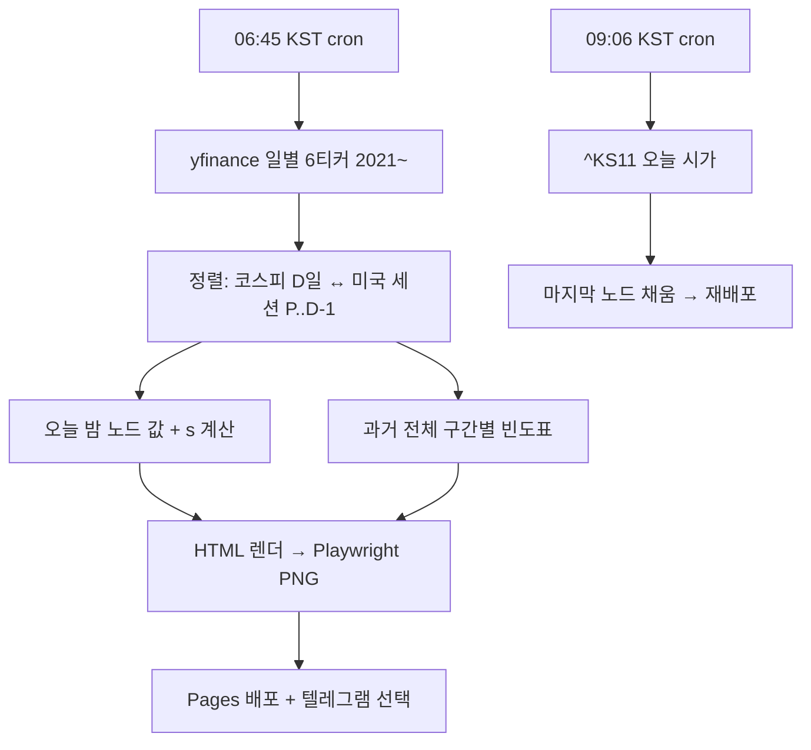

# 밤사이 코스피 (구 코스피 릴레이) — 설계

> 2026-09-06 이름 변경: 검색 자동완성 실측("코스피 " 1위 야간선물, "밤사이 미국증시" 실존)으로 은유(릴레이)보다 시간 프레임(밤사이)이 수요 어휘. 릴레이는 차트 이름으로 존치.

## Overview

**What.** 매일 아침 한 장. 전날 코스피 마감에서 밤사이 미국 마감을 거쳐 오늘 코스피 시가까지, 바통이 어떻게 넘어왔는지 보여주는 정적 페이지 + 공유용 이미지. 하단에 조건부 빈도 한 줄 — "지난 5년, 이런 밤 다음 날 코스피 시가는 N번 중 M번 위로 열렸습니다."

**Why.** 개장 전 정보는 이미 넘치지만(네이버·다음·삼프로·증권사 시황) 전부 숫자 나열이거나 말로 풀어 놓은 것. 밤의 *구조*를 한 장으로 보여주는 형식이 없다. 판정(예측)은 규제·정확도 부담이 있고, 성적표는 서비스 자체를 도박판으로 만든다. 흐름 + 과거 빈도만 보여주고 판단은 보는 사람에게 남긴다.

**근거.** 2021-01~2026-09 백테스트(n=1,314, 표본 외 1,062): 미국 마감(SPY·SOXX)만으로 코스피 시가 방향이 확신 구간 86%, 연도별 전부 ≥80%. 적합 없는 고정식 `(SPY+SOXX)/2 × 0.4`도 84%. 즉 밤과 아침 사이 관계는 실재하고, 결정적 코드로 충분하다. 상세: 메모리 `project_kospi_open_relay`.

**누가.** 아침 7시 전후 폰으로 "오늘 어떻게 열리나" 확인하는 국내 개인 투자자. 텔레그램·X에서 이미지 한 장으로 소비.

## Constraints (어길 수 없는 것)

- **예측 문구 금지.** "갭업 예상", "오를 것" 류 단정 표현 없음. 과거 빈도 서술만. 매수·매도·종목 언급 없음. 하단 고지: 정보 제공, 투자 판단 아님
- **원시 시세 숫자 최소화.** 지수 절대값 대신 변화율(%)만 표시. 인트라데이 데이터 사용 안 함(일별 종가·시가만)
- **시가까지만 말한다.** 갭과 당일 나머지 장의 상관은 0.137. "오늘 장"이 아니라 "오늘 시가"
- **앱인토스 아님.** 시황 = 금융서비스 취급. 웹 전용
- **유지비 0.** 서버 없음. GitHub Actions 크론 + GitHub Pages 정적 배포
- **한국 색 규약.** 상승 = 빨강, 하락 = 파랑

## Principles (지향)

- 형식이 무기. 스크린샷돼 돌아다닐 만큼 한 장이 단정해야 함. 장식보다 위계
- 매일 같은 시각, 같은 형식. 습관이 재방문 장치
- 미국이 조용했는데 한국이 튄 날도 그대로 보인다. 릴레이는 사후에 시가 노드가 채워져 기록이 된다

## Requirements

### Narrative

06:45 KST, 액션이 돈다. 어제 코스피·코스닥 마감을 첫 노드로, 05:00에 끝난 미국 세션(S&P500·나스닥100·필라델피아 반도체를 ETF SPY·QQQ·SOXX로, 공포지수 VIX)을 둘째 노드로 세로 릴레이를 그린다. 그 아래 조건부 빈도 한 줄. 마지막 노드 "오늘 코스피 시가"는 비어 있다. 페이지와 PNG를 Pages에 배포하고, 토큰이 있으면 텔레그램 채널에 PNG를 올린다.

09:06 KST, 두 번째 액션. 오늘 코스피 시가를 받아 마지막 노드를 채우고 재배포한다. 릴레이가 완성된 어제 페이지는 그대로 기록으로 남는다(`/2026-09-05/`). 휴장이면 시가 노드에 "휴장".

### Details

**데이터 (v0).** yfinance 일별: `^KS11 ^KQ11 SPY QQQ SOXX ^VIX`. 2021-01-01부터 전체 재수집(상태 없음). 미국 세션 귀속: 코스피 전일 종가 날짜 P ≤ 미국 세션 날짜 ≤ D-1, 그 구간 close-to-close 누적. 해당 세션 없으면(미국 휴장) "밤사이 미국 휴장" 표시.
→ 결정: v0는 야후(ToS 회색, 비용 0). **애드센스 켜는 시점에 유료 API(월 3만원대)로 전환**이 트리거.

**릴레이 노드.** ① 15:30 코스피·코스닥 마감 % ② 05:00 미국 마감 SOXX·QQQ·SPY % + VIX 변화 ③ 09:00 코스피 시가 %(비움→채움). 유럽·EWY는 정보량 0이라 제외.

**조건부 빈도.** 신호 `s = 0.4 × (SPY + SOXX) / 2`. 5구간: s ≥ +0.5% / +0.3~+0.5 / ±0.3 / −0.3~−0.5 / ≤ −0.5. 오늘 밤이 속한 구간의 과거 전체(2021~)에서 시가 갭 >+0.3% / <−0.3% / 그 사이 비율을 세고, 최다 결과를 문장으로: "지난 N년 이런 밤 M번 중 K번(P%) 시가가 위로 열렸습니다." 보합 구간이면 "±0.3% 안에서 열린 날이 P%". 표본 수 항상 노출.

**출력.** `site/index.html`(오늘), `site/YYYY-MM-DD/index.html`(기록), `site/relay.png`(1080×1350, 공유용), `site/latest.json`. PNG는 같은 HTML을 Playwright로 캡처 — 페이지와 이미지가 한 디자인.

**배포.** GitHub Actions cron `45 21 * * 0-4`(06:45 KST 월~금) · `6 0 * * 1-5`(09:06 KST). Pages 배포. 텔레그램은 `TELEGRAM_BOT_TOKEN`·`TELEGRAM_CHAT_ID` 시크릿 있을 때만.

**실패 처리.** 야후 실패 → 직전 페이지 유지, 액션 실패 알림(GitHub 기본). 부분 실패(티커 하나 결손) → 해당 노드 "—" 표시하고 나머지 발행. 조건부 빈도는 SPY·SOXX 둘 다 있을 때만.

### Flow

## 앱인토스 트랙 (추가, 같은 날 밤)

June 결정으로 미니앱도 낸다. 웹 파이프라인이 단일 진실이고, 미니앱은 `latest.json`(SVG 포함)·`days/*.json`·`index.json`을 읽어 그리는 얇은 껍데기다. 로직 중복 0.
- 화면: 오늘 릴레이 카드 → 조건부 빈도 → 공유(TDS Button, lazy) → 지난 릴레이 날짜 칩 → 설명·고지. 자체 내비바·탭바·진입 모달 없음
- 첫 페인트는 번들 시드(`scripts/gen-seed.mjs`)로 네트워크 무관. TDS는 lazy 청크+ErrorBoundary
- 딥링크 `/d/YYYY-MM-DD` (후행 슬래시 정규화)
- 정책 방어: 종목·매매·예측 없음, 카테고리 생활>정보>기타(환율 신호등 선례)

## Non-goals

예측·판정 문구 / 성적표·적중률 / 인트라데이 곡선 / 종목·섹터 / 로그인·알림 / 유럽·환율·EWY 노드(정보량 0) / 야간선물(합법 무료 소스 없음)

## 미결

도메인(없으면 `mjs0611.github.io/kospi-relay`) · 텔레그램 채널 개설 · 애드센스 시점

## References

메모리 `project_kospi_open_relay` `reference_market_data_licensing` `project_signal_series` `feedback_ideation_filter`
